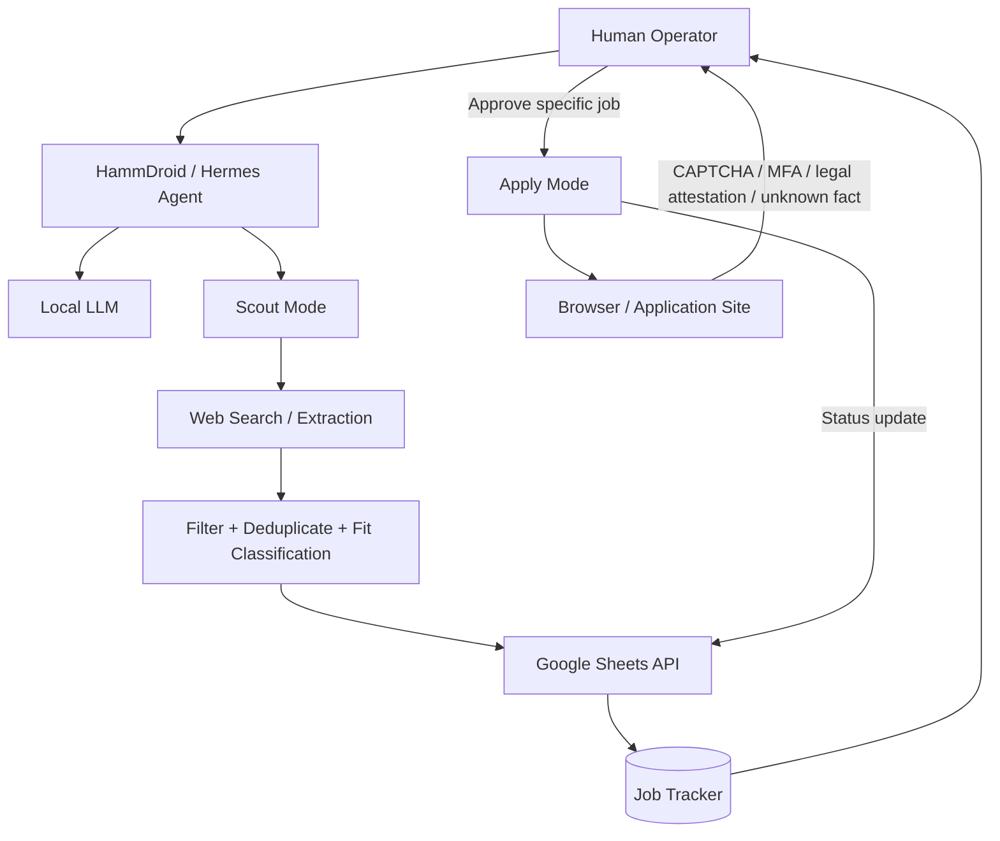

# HammDroid Job Agent

A local-first AI job-search agent built around **Hermes Agent**, a locally served language model, and **Google Sheets** as the job-state layer.

The immediate goal is simple: let the agent discover and triage jobs, store structured results in a spreadsheet, and keep a human approval step before any application action.

> This repository documents the integration and operating model. It intentionally excludes OAuth client secrets, refresh tokens, account identifiers, and machine-specific credentials.

## Why this project exists

Browser-only automation is fragile and expensive for repetitive state management. A spreadsheet API is a better fit for things like:

- job discovery queues
- deduplication
- fit classifications
- application status
- review/approval state
- audit history

The agent can use browser automation where a browser is actually necessary, while Google Sheets provides a fast structured source of truth.

## Architecture



## Current status

The Google Sheets integration has been tested end-to-end:

- OAuth authentication: **working**
- Google Sheets API: **working**
- spreadsheet creation: **working**
- cell write/update: **working**
- cell read-back: **working**
- broad Google Drive access: **not granted**
- job-tracker workflow: **next phase**

A temporary test spreadsheet was created, values were written, and the same values were successfully read back through the API.

## Google Sheets OAuth setup

### 1. Create a Google Cloud project

Create a dedicated project for the agent integration. Keeping the integration isolated makes the OAuth client and API configuration easier to reason about.

### 2. Configure Google Auth Platform

For a personal/private integration:

- configure the app information
- use an **External** audience if appropriate for the account type
- keep the app in testing while developing
- add the account that will authorize the integration as a **test user**

Without the account in the test-user list, Google may return an OAuth `403 access_denied` message saying the app has not completed verification.

### 3. Create an OAuth client

Create an OAuth 2.0 client with:

```text
Application type: Desktop app
```

Download the JSON client credential.

Do **not** commit that file.

### 4. Store credentials outside the agent workspace

The OAuth client file and generated token should live in the agent/framework credential area rather than inside the normal working directory.

For Hermes, the credential location is derived from `HERMES_HOME` when that environment variable is available.

Example only:

```text
HERMES_HOME=/path/to/hermes-home
```

The important runtime artifact is the generated Google OAuth token. Treat it as a secret.

### 5. Enable the Google Sheets API

OAuth authentication and API activation are separate controls.

A valid OAuth token can still receive:

```text
HTTP 403
SERVICE_DISABLED
service=sheets.googleapis.com
```

if the Google Sheets API has not been enabled for the Cloud project.

Enable **Google Sheets API** in the project, then retry the same API operation.

### 6. Complete OAuth

The Hermes Google Workspace flow generates a Google authorization URL. After consent, a desktop OAuth callback may point to a localhost address that does not successfully load in the browser.

The failed page itself is not necessarily the failure condition. The callback URL can still contain the authorization response required by the OAuth helper.

Do not paste authorization codes, callback URLs containing codes, tokens, or client secrets into public logs or repositories.

## Permission model

The integration was intentionally tested without granting general Drive read access.

The effective design is:

```text
Google Sheets access      allowed
General Drive browsing    not granted
Gmail                     not granted
Calendar                  not granted
Contacts                  not granted
Docs                      not granted
```

### Important limitation

The standard Google Sheets OAuth scope is not a per-spreadsheet security boundary. If a token has the Sheets scope, the agent may technically be able to operate on spreadsheets accessible to that Google account.

The project therefore uses an additional **agent policy** restricting normal operation to the designated job-tracker spreadsheet.

For stronger isolation, use a dedicated Google account or a narrower per-file architecture.

## What went wrong during setup

The integration itself was fairly small. The interesting part was controlling the agent while troubleshooting it.

During early setup the local agent attempted to improvise by:

- speculating about OAuth redirect behavior
- modifying framework source code
- changing requested scopes
- copying credentials into alternate locations
- retrying authentication through interactive browser flows

Those actions were more dangerous than the original configuration problem.

The operating rule was simplified to:

```text
Use intended method
        ↓
Attempt operation
        ↓
Read exact error
        ↓
One justified retry
        ↓
STOP and report
```

Not:

```text
Fail
 ↓
Invent workaround
 ↓
Modify framework
 ↓
Change authentication
 ↓
Keep experimenting
```

Once that boundary was enforced, troubleshooting became much cleaner. For example, the agent surfaced the exact `SERVICE_DISABLED` error for the Sheets API and stopped instead of attempting to redesign the integration.

## Agent operating model

### Scout Mode

Scout Mode is discovery-only.

The agent may:

- search job sources
- extract job descriptions
- filter obvious mismatches
- deduplicate listings
- classify fit
- write results to the job tracker

The agent may not:

- submit applications
- upload files
- contact employers
- change account settings
- start new OAuth flows

### Apply Mode

Apply Mode handles **one explicitly approved job at a time**.

The agent should stop and ask for human input when it encounters:

- CAPTCHA
- MFA/passkeys
- legal attestations
- assessments
- unclear factual questions
- missing personal information
- ambiguous salary/clearance/experience questions

Applications are never submitted without explicit authorization.

## Truthfulness rule

The agent must never convert education, certifications, labs, homelabs, coursework, or portfolio projects into professional employment experience.

It must not invent:

- employers
- job dates
- years of experience
- clearances
- salaries
- certifications
- skills
- application answers

This rule is part of the application system, not a stylistic preference.

## Planned job tracker

The Google Sheet will act as the authoritative queue and state store. Planned fields include:

| Field | Purpose |
|---|---|
| Date Found | Discovery date |
| Job Title | Posted role |
| Company | Employer |
| Location | Job location |
| Work Arrangement | On-site / hybrid / remote |
| Salary / Pay | Compensation when available |
| Experience Required | Stated experience requirement |
| Required Qualifications | Hard requirements |
| Preferred Qualifications | Nice-to-have requirements |
| Fit Rating | STRONG APPLY / APPLY / STRETCH |
| Short Fit Reason | Concise rationale |
| Active Status | Verified / unverified |
| Source | Job source |
| Job URL | Listing URL |
| Application URL | Direct application URL |
| Status | NEW / APPROVED / APPLIED / etc. |

## Roadmap

- [x] Run local agent through Hermes
- [x] Authenticate Google OAuth
- [x] Enable Google Sheets API
- [x] Prove create → write → read round trip
- [x] Establish authentication and agent guardrails
- [ ] Build production job-tracker sheet
- [ ] Add deterministic deduplication rules
- [ ] Add Scout Mode batch discovery
- [ ] Add human review/approval workflow
- [ ] Add one-job-at-a-time Apply Mode
- [ ] Add reviewer/critic pass for uncertain listings
- [ ] Add metrics for reviewed / retained / applied jobs

## Security notes

Never commit:

- `client_secret*.json`
- OAuth token files
- refresh tokens
- authorization callback URLs containing codes
- `.env` files containing secrets
- browser profiles or session cookies

The included `.gitignore` blocks common credential filenames, but repository hygiene is still the operator's responsibility.

## Key lesson

The hardest part was not calling the Sheets API. It was defining **where agent autonomy stops**.

For local autonomous systems, a useful safety boundary is:

> The agent may use an already-approved capability, but it may not expand its own permissions, modify its framework, redesign authentication, or invent a fallback when a security boundary blocks it.

That boundary made the system both safer and easier to debug.
