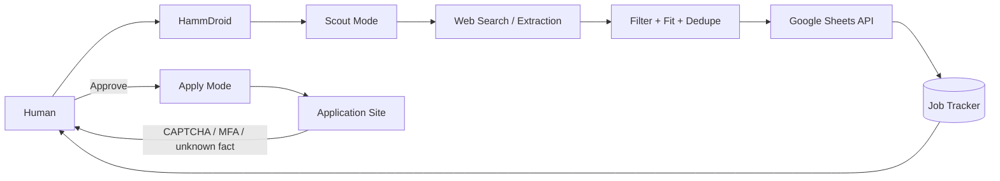

# HammDroid Job Agent

A local-first AI job-search agent built with **Hermes Agent**, a locally served language model, and **Google Sheets** as the job-state layer.

The goal is to automate repetitive discovery and tracking while keeping consequential actions — authentication, security prompts, and application submission — under human control.

## Current status

### Working

- [x] Local agent running through Hermes
- [x] Google OAuth authentication
- [x] Google Sheets API integration
- [x] Create → write → read round-trip validation

### Designed / in progress

- [x] Agent guardrail policy
- [x] Job workflow architecture
- [ ] Production job tracker
- [ ] Scout Mode batch discovery
- [ ] Human approval queue
- [ ] One-job-at-a-time Apply Mode

## Architecture



## Documentation

The repo is intentionally small. Each document covers one real part of the system:

| Document | Purpose |
|---|---|
| [Architecture](docs/architecture.md) | Components, modes, and trust boundary |
| [Google Sheets Integration](docs/google-sheets-integration.md) | OAuth setup, API enablement, validation, and real errors encountered |
| [Agent Guardrails](docs/guardrails.md) | Limits on authentication, troubleshooting, and autonomous changes |
| [Job Workflow](docs/job-workflow.md) | Scout → Sheet → Approval → Apply state model |

## Core design decisions

### API for state, browser for browser work

Google Sheets is used as a lightweight structured state store for discovered jobs, fit ratings, deduplication, approval status, and application status.

Browser automation is reserved for tasks that genuinely require a browser.

### Human approval stays in the loop

The agent may discover and prepare work autonomously, but it must stop for:

- CAPTCHA
- MFA/passkeys
- legal attestations
- assessments
- unknown factual questions
- authentication changes
- application submission

### Truthfulness is a hard rule

Education, certifications, coursework, labs, homelabs, and portfolio projects must never be represented as professional employment experience.

The agent must not invent employers, dates, years of experience, clearances, salaries, certifications, skills, or application answers.

## Security model

The tested OAuth setup grants Google Sheets access without general Google Drive browsing permission.

```text
Google Sheets access      allowed
General Drive browsing    not granted
Gmail                     not granted
Calendar                  not granted
Contacts                  not granted
Docs                      not granted
```

The Sheets OAuth scope is still broader than a single spreadsheet, so the agent also has a behavioral policy restricting normal operation to the designated job tracker.

Never commit OAuth client secrets, token files, refresh tokens, authorization callback URLs, `.env` secrets, browser profiles, or session cookies.

## Main lesson

The difficult part was not the Sheets API call. It was defining where agent autonomy stops.

```text
Use intended method
      ↓
Attempt
      ↓
Inspect exact error
      ↓
One justified retry
      ↓
STOP + report
```

That boundary made the system safer and much easier to debug.
