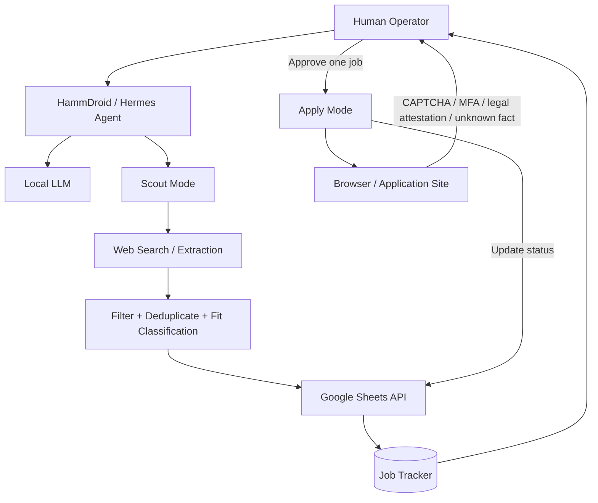

# Architecture

## Goal

HammDroid is a local-first job-search agent. It automates repetitive discovery and tracking work while keeping sensitive or consequential actions behind a human approval step.

## System design

## Why Google Sheets is used

The spreadsheet acts as the lightweight state layer rather than relying on browser automation for every update.

It stores:

- discovered jobs
- deduplication state
- fit classifications
- verification status
- application URLs
- approval state
- application status

The browser is reserved for tasks that actually require a browser, such as opening an application portal.

## Operating modes

### Scout Mode

Scout Mode may:

- search job sources
- extract listings
- classify fit
- deduplicate jobs
- write structured rows to the tracker

Scout Mode may not:

- submit applications
- upload resumes
- contact employers
- change authentication
- modify account settings

### Apply Mode

Apply Mode handles one explicitly approved job at a time.

It must stop for:

- CAPTCHA
- MFA or passkeys
- legal attestations
- assessments
- unclear factual questions
- missing personal information
- ambiguous experience, clearance, salary, or eligibility questions

Submission requires explicit human authorization.

## Trust boundary

> The agent may use an already-approved capability, but it may not expand its own permissions, redesign authentication, modify its framework, or invent a workaround when a security boundary blocks it.
