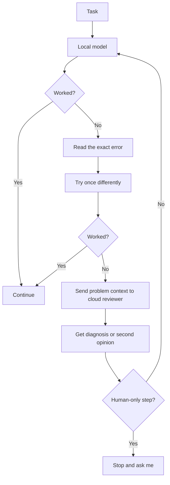

# Design Decisions

This is the reasoning behind the current HammDroid setup.

I am building it in small pieces because I want to understand what each part is doing before I add more moving parts.

## Run routine AI work locally

A job-search agent can make a lot of small model calls. I already have a computer that can run a useful local model, so it makes sense to use that for routine work instead of sending everything to a paid API.

My current idea is:

```text
normal repetitive work
→ local model

uncertain or important review
→ stronger cloud model later if needed
```

The cloud review part is still an idea, not a finished feature.

Local inference also makes the setup easier for me to inspect. I can check which model is loaded, whether it is using the GPU, where the files are stored, and which endpoint Hermes is calling.

## Use the cloud model when the local model gets stuck

I do not want the cloud model handling every task. I want it to be the second set of eyes when the local model has a reason to ask for help.

A failure path I want to test looks like this:



The point is not to use the cloud model as a blind fallback. The local side should first collect enough information to make the cloud request useful.

That could include:

- what task it was trying to do
- the exact error
- what it already tried
- the relevant non-secret configuration or output
- what it thinks may be wrong

I do not want it sending secrets, OAuth tokens, browser cookies, passwords, or entire sessions just because something failed.

The same idea can work for uncertainty even when there is no hard error:

```text
local model reaches a clear answer
→ continue locally

local model is unsure or evidence conflicts
→ ask the cloud model for a second opinion
```

Some things should not go through that loop at all. If the blocker is CAPTCHA, MFA, a legal attestation, an unknown personal fact, a permission boundary, or final submission, the next step is me, not another model.

This lets me use my own hardware for the volume while saving cloud calls for cases where stronger reasoning may actually help.

## Hermes instead of building an agent framework

The part I care about is the job-search workflow. I do not need to build tool routing and agent plumbing from scratch just to get there.

Hermes already provides the agent layer. That lets me focus on things such as:

- connecting the local model
- choosing which tools the agent gets
- connecting Google Sheets
- deciding what the agent can do on its own
- deciding when it has to stop and ask me

I did not build Hermes itself.

## Use Ollama to serve the local model

I wanted the model runtime separate from Hermes.

The setup is:

```text
Hermes
→ Ollama endpoint
→ local model
→ GPU
```

Hermes talks to Ollama through `http://localhost:11434/v1`. Ollama handles loading and running the model.

This also means I can try a different local model later without rebuilding the rest of the workflow.

I moved the model files to `E:\AI\Models` because they are large and I did not want them taking up the main Windows drive.

## Start with one model

I looked into the idea of using several models for different jobs, such as one model doing the work and another reviewing it.

I decided not to start there. More models means more memory use, more waiting, more routing logic, and overall more troubleshooting.

For now, I would rather get one model working through the full workflow first. If I find a real weakness that another model would help with, then I can add one for a reason.

## Google Sheets over a database

The state I need right now is simple. It is mostly rows of job information such as company, role, status, dates, links, and notes.

Sheets gives me:

- persistent storage
- API access
- a format I can open and edit myself
- no separate database server to maintain

That is enough for the current stage.

If I need stronger querying, relationships between records, several things writing at once, or better history, then moving to a database would be beneficial.

## Use the Sheets API instead of clicking through the site

If the agent needs to update the sheet, using the API is cleaner than automating mouse clicks in the browser.

The API gives me a simpler path to troubleshoot:

```text
OAuth
→ API request
→ spreadsheet operation
→ returned result
```

That already helped during setup because the problems came from different places. I had a credential path issue, an OAuth issue, a disabled API, and a malformed request. Those were easier to separate because the spreadsheet was being accessed through an API.

## Keep credentials out of Git

Hermes needs local OAuth files and token data, but those do not belong in the repo.

The repo holds documentation and non-secret project files. OAuth client files, tokens, local Hermes state, and browser session files stay on the machine and are ignored by Git.

## Keep final decisions with me

I want the agent to handle repetitive work, but I do not want it inventing answers or submitting things I did not review.

It should stop for:

- CAPTCHA
- MFA or passkeys
- legal attestations
- assessments
- questions where the correct factual answer is unknown
- final application submission

It also should not make up employment history, dates, clearances, certifications, skills, or experience.

## Keep the pieces separate enough to troubleshoot

I want to be able to tell which part failed instead of treating HammDroid as one big system.

For example:

```text
model will not run
→ check Ollama, the model, and the GPU

Hermes cannot reach the model
→ check the local provider settings and endpoint

Google login fails
→ check the credential path and OAuth setup

OAuth works but Sheets fails
→ check API enablement and the request itself
```

That is the main reason I am building it in layers.

## Next step

The local model path and the Google Sheets path have both been tested on their own.

The next useful step is connecting them into the job-search workflow and seeing where the local model is good enough, where a cloud review actually helps, and where I still need to step in.
